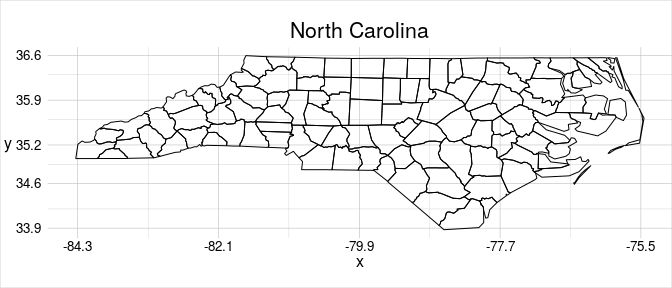
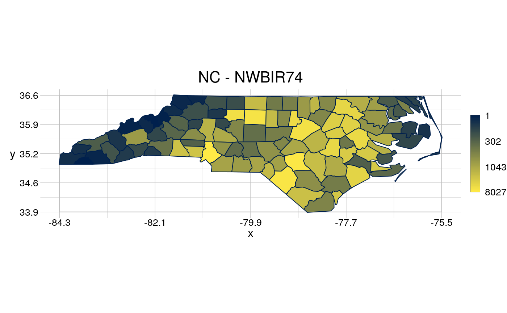

<!-- README.md is generated from README.Rmd. Please edit that file -->

# geometr <a href='https://ehrmanns.github.io/geometr/'></a>

[](https://cran.r-project.org/package=geometr)
[](https://travis-ci.org/EhrmannS/geometr)
[](https://ci.appveyor.com/project/EhrmannS/geometr)
[](https://codecov.io/github/EhrmannS/geometr?branch=master)
[](https://cran.rstudio.com/web/packages/geometr/index.html)
[](https://www.tidyverse.org/lifecycle/#maturing)

## Overview

The `geometr` package provides tools that generate and process easily
accessible and tidy geometric shapes (of class `geom`). Moreover, it
aims to improve interoperability of spatial and other geometric classes.
Spatial classes are typically a collection of geometric shapes (or their
vertices) that are accompanied by various metadata (such as attributes
and a coordinate reference system). Most spatial classes are thus
conceptually quite similar, yet a common standard lacks for accessing
features, vertices or the metadata. `Geometr` fills this gap by
providing tools

  - that produce an identical output for the same metadata of different
    classes (via so-called getters) and
  - that use an identical input to write to various classes that
    originally require different input (via so-called setters).

## Installation

1)  Install the development version from github and load it:

<!-- end list -->

``` r
devtools::install_github("EhrmannS/geometr")
```

2)  The
    [vignette](https://ehrmanns.github.io/geometr/articles/geometr.html)
    gives a more in depth introduction, explains `geometr`s take on
    interoperability and discusses the spatial class `geom` that comes
    with `geometr`.

3)  Have fun being a
    [geometer](https://en.wikipedia.org/wiki/List_of_geometers)\!

## Examples

Create a `geom`

``` r
library(geometr)

# ... from other classes
library(sf)
#> Linking to GEOS 3.5.1, GDAL 2.2.2, PROJ 4.9.2
nc_sf <- st_read(system.file("shape/nc.shp", package="sf"), quiet = TRUE)
nc_geom <- gc_geom(input = nc_sf)

# ... or by hand.
library(tibble)
coords <- tibble(x = c(40, 70, 70, 50),
                 y = c(40, 40, 60, 70))
window <- tibble(x = c(0, 80),
                 y = c(0, 80))
aGeom <- gs_polygon(anchor = coords, window = window)

# The "tiny map" shows where the vertices are concentrated.
nc_geom
#> geom        polygon
#>             108 features | 2529 points
#> crs         +proj=longlat +datum=NAD27 +no_defs
#> attributes  (features) AREA, PERIMETER, CNTY_, CNTY_ID, NAME, FIPS, FIPSNO, CRESS_ID, BIR74, ...
#> tiny map           36.59 
#>                    ◌ ○ ◌ ○        
#>                    ○ ○ ○ ○        
#>                    ◌ ◌ ○ ◌        
#>             -84.32 ◌ ◌ ◌ ◌ -75.46 
#>                    33.88
```

Metadata of different classes can be extracted in interoperable quality
(i.e. the same metadata in the same arrangement).

``` r
getTable(x = nc_sf)
#> Registered S3 method overwritten by 'cli':
#>   method     from    
#>   print.boxx spatstat
#> # A tibble: 108 x 16
#>      fid   gid  AREA PERIMETER CNTY_ CNTY_ID NAME  FIPS  FIPSNO CRESS_ID
#>    <int> <int> <dbl>     <dbl> <dbl>   <dbl> <fct> <fct>  <dbl>    <int>
#>  1     1     1 0.114      1.44  1825    1825 Ashe  37009  37009        5
#>  2     2     2 0.061      1.23  1827    1827 Alle… 37005  37005        3
#>  3     3     3 0.143      1.63  1828    1828 Surry 37171  37171       86
#>  4     4     4 0.07       2.97  1831    1831 Curr… 37053  37053       27
#>  5     5     4 0.07       2.97  1831    1831 Curr… 37053  37053       27
#>  6     6     4 0.07       2.97  1831    1831 Curr… 37053  37053       27
#>  7     7     5 0.153      2.21  1832    1832 Nort… 37131  37131       66
#>  8     8     6 0.097      1.67  1833    1833 Hert… 37091  37091       46
#>  9     9     7 0.062      1.55  1834    1834 Camd… 37029  37029       15
#> 10    10     8 0.091      1.28  1835    1835 Gates 37073  37073       37
#> # … with 98 more rows, and 6 more variables: BIR74 <dbl>, SID74 <dbl>,
#> #   NWBIR74 <dbl>, BIR79 <dbl>, SID79 <dbl>, NWBIR79 <dbl>
getTable(x = nc_geom, slot = "feature")
#> # A tibble: 108 x 16
#>      fid   gid  AREA PERIMETER CNTY_ CNTY_ID NAME  FIPS  FIPSNO CRESS_ID
#>    <int> <int> <dbl>     <dbl> <dbl>   <dbl> <fct> <fct>  <dbl>    <int>
#>  1     1     1 0.114      1.44  1825    1825 Ashe  37009  37009        5
#>  2     2     2 0.061      1.23  1827    1827 Alle… 37005  37005        3
#>  3     3     3 0.143      1.63  1828    1828 Surry 37171  37171       86
#>  4     4     4 0.07       2.97  1831    1831 Curr… 37053  37053       27
#>  5     5     4 0.07       2.97  1831    1831 Curr… 37053  37053       27
#>  6     6     4 0.07       2.97  1831    1831 Curr… 37053  37053       27
#>  7     7     5 0.153      2.21  1832    1832 Nort… 37131  37131       66
#>  8     8     6 0.097      1.67  1833    1833 Hert… 37091  37091       46
#>  9     9     7 0.062      1.55  1834    1834 Camd… 37029  37029       15
#> 10    10     8 0.091      1.28  1835    1835 Gates 37073  37073       37
#> # … with 98 more rows, and 6 more variables: BIR74 <dbl>, SID74 <dbl>,
#> #   NWBIR74 <dbl>, BIR79 <dbl>, SID79 <dbl>, NWBIR79 <dbl>
```

A `geom` has three attribute tables, one for vertices, one for features
and one for groups of features, all of which can be provided with
ancillary information ([details on data structure of a
`geom`](https://ehrmanns.github.io/geometr/articles/geometr.html#description-of-the-class-geom).

``` r
getTable(x = nc_geom, slot = "point")
#> # A tibble: 2,529 x 3
#>        x     y   fid
#>    <dbl> <dbl> <int>
#>  1 -81.5  36.2     1
#>  2 -81.5  36.3     1
#>  3 -81.6  36.3     1
#>  4 -81.6  36.3     1
#>  5 -81.7  36.4     1
#>  6 -81.7  36.5     1
#>  7 -81.7  36.5     1
#>  8 -81.7  36.6     1
#>  9 -81.3  36.6     1
#> 10 -81.3  36.5     1
#> # … with 2,519 more rows
```

Groups of features are called *multi\** features in other packages. By
lumping several closed geometric shapes into one multi\* feature, the
separate geometric shapes can’t be attributed with ancillary information
any more. In a `geom`, multi\* features are separated into distinct
(simpler) features, while the attributes of multi\* features can be
captured by the *group attribute table*.

``` r
nc_geom2 <- gc_geom(input = nc_sf, group = TRUE)
currituck <- getSubset(x = nc_geom2, gid == 4)
getTable(x = currituck, slot = "feature")
#> # A tibble: 3 x 2
#>     fid   gid
#>   <int> <int>
#> 1     4     4
#> 2     5     4
#> 3     6     4
getTable(x = currituck, slot = "group")
#> # A tibble: 1 x 15
#>     gid  AREA PERIMETER CNTY_ CNTY_ID NAME  FIPS  FIPSNO CRESS_ID BIR74
#>   <int> <dbl>     <dbl> <dbl>   <dbl> <fct> <fct>  <dbl>    <int> <dbl>
#> 1     4  0.07      2.97  1831    1831 Curr… 37053  37053       27   508
#> # … with 5 more variables: SID74 <dbl>, NWBIR74 <dbl>, BIR79 <dbl>,
#> #   SID79 <dbl>, NWBIR79 <dbl>
```

Visualise a `geom` and use quick options to scale attributes to plot
properties.

``` r
visualise(`North Carolina` = nc_geom)
```



``` r
visualise(`NC - NWBIR74` = nc_geom, fillcol = NWBIR74)
```



A `geom` has the slot `@window`, which contains a reference window, so
to speak. This reference window can be used or modified in many
functions of `geometr`

``` r
visualise(`Currituck` = currituck, window = getExtent(currituck))
```


Finally, cast a `geom` to another type simply by providing it in
`anchor` of the respective type

``` r
library(magrittr)
boundPoints <- gs_point(anchor = currituck) %>% 
   setWindow(to = getExtent(.))
visualise(`Currituck - boundary vertices`= boundPoints)
```


