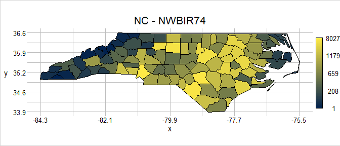

<!-- README.md is generated from README.Rmd. Please edit that file -->

# geometr <a href='https://ehrmanns.github.io/geometr/'></a>

<!-- badges: start -->

[](https://github.com/EhrmannS/geometr/actions)
[](https://codecov.io/github/EhrmannS/geometr?branch=master)
[](https://cran.r-project.org/package=geometr)
[](https://cran.r-project.org/package=geometr)

<!-- badges: end -->

## Overview

The `geometr` package provides tools that generate and process easily
accessible and tidy geometric shapes (of class `geom`). Moreover, it
aims to improve interoperability of spatial and other geometric classes.
Spatial classes are typically a collection of geometric shapes (or their
vertices) that are accompanied by various metadata (such as attributes
and a coordinate reference system). Most spatial classes are thus
conceptually quite similar, yet a common standard lacks for accessing
features, vertices or the metadata. `geometr` fills this gap by
providing tools that

-   produce an identical output for the same metadata of different
    classes (via so-called getters) and
-   use an identical input to write to various classes that originally
    require different input (via so-called setters).

## Installation

1.  Install the official version from CRAN:

``` r
install.packages("geometr")
```

or the latest development version from github:

``` r
devtools::install_github("EhrmannS/geometr")
```

2.  The
    [vignette](https://ehrmanns.github.io/geometr/articles/geometr.html)
    gives an in depth introduction, explains the take on
    interoperability and discusses the spatial class `geom` that comes
    with `geometr`.

3.  Have fun being a
    [geometer](https://en.wikipedia.org/wiki/List_of_geometers)!

## Examples

Create a `geom`

``` r
library(geometr)

# ... from other classes
library(sf)
nc_sf <- st_read(system.file("shape/nc.shp", package="sf"), quiet = TRUE)
nc_geom <- gc_geom(input = nc_sf)
```

Metadata of different classes can be extracted in interoperable quality
(i.e. the same metadata in different objects/classes have the same names
and the same arrangement).

``` r
getExtent(x = nc_geom)
#> # A tibble: 2 × 2
#>       x     y
#>   <dbl> <dbl>
#> 1 -84.3  33.9
#> 2 -75.5  36.6

getFeatures(x = nc_geom)
#> # A tibble: 108 × 16
#>      fid   gid  AREA PERIMETER CNTY_ CNTY_ID NAME    FIPS  FIPSNO CRESS_ID BIR74
#>  * <int> <int> <dbl>     <dbl> <dbl>   <dbl> <chr>   <chr>  <dbl>    <int> <dbl>
#>  1     1     1 0.114      1.44  1825    1825 Ashe    37009  37009        5  1091
#>  2     2     2 0.061      1.23  1827    1827 Allegh… 37005  37005        3   487
#>  3     3     3 0.143      1.63  1828    1828 Surry   37171  37171       86  3188
#>  4     4     4 0.07       2.97  1831    1831 Currit… 37053  37053       27   508
#>  5     5     4 0.07       2.97  1831    1831 Currit… 37053  37053       27   508
#>  6     6     4 0.07       2.97  1831    1831 Currit… 37053  37053       27   508
#>  7     7     5 0.153      2.21  1832    1832 Northa… 37131  37131       66  1421
#>  8     8     6 0.097      1.67  1833    1833 Hertfo… 37091  37091       46  1452
#>  9     9     7 0.062      1.55  1834    1834 Camden  37029  37029       15   286
#> 10    10     8 0.091      1.28  1835    1835 Gates   37073  37073       37   420
#> # … with 98 more rows, and 5 more variables: SID74 <dbl>, NWBIR74 <dbl>,
#> #   BIR79 <dbl>, SID79 <dbl>, NWBIR79 <dbl>
```

`geometr` only knows the feature types `point`, `line`, `polygon` and
`grid` (a systematic lattice of points). In contrast to the simple
features standard, there are no *MULTI\** features. The way simple
features have been implemented in R has the consequence that certain
information can only be stored in a rather inefficient and cumbersome
way. Think of a set of polygons that has individual attributes at the
`POLYGON` level, but also attributes at the group (`MULTIPOLYGON`)
level, i.e., where all polygons of that group have the same value of the
respective attributes. It is impossible to store this information in a
single `sf` object, other than in a `POLYGON` that contains the
respective attributes as duplicates (which may be very inefficient in
large objects).

The backbone of a `geom` are three tables, one for points, one for
features and one for groups of features, the latter two of which can be
provided with ancillary information (attributes). Each point is stored
with a feature ID (`fid`) that relates it to a feature (and its
attributes) and each feature is stored with a group ID (`gid`) that
relates it to a group (and its attributes). Eventually this results in a
tidier data-structure with easier access than `sp` or `sf` objects and
with higher versatility.

``` r
# when using the group = TRUE argument, the attributes of MULTI*-feature are
# stored in the group attribute table of a geom
nc_geom <- gc_geom(input = nc_sf, group = TRUE)
currituck <- gt_filter(obj = nc_geom, gid == 4)

getFeatures(x = currituck)
#> # A tibble: 3 × 2
#>     fid   gid
#>   <int> <int>
#> 1     4     4
#> 2     5     4
#> 3     6     4
getGroups(x = currituck)
#> # A tibble: 1 × 15
#>     gid  AREA PERIMETER CNTY_ CNTY_ID NAME     FIPS  FIPSNO CRESS_ID BIR74 SID74
#>   <int> <dbl>     <dbl> <dbl>   <dbl> <chr>    <chr>  <dbl>    <int> <dbl> <dbl>
#> 1     4  0.07      2.97  1831    1831 Curritu… 37053  37053       27   508     1
#> # … with 4 more variables: NWBIR74 <dbl>, BIR79 <dbl>, SID79 <dbl>,
#> #   NWBIR79 <dbl>

# and new attributes can be set easily, 
newTable <- data.frame(fid = c(1:108), 
                       attrib = rnorm(108))
(nc_geom <- setFeatures(x = nc_geom, table = newTable))
#> geom        polygon
#>             100 groups | 108 features | 2529 points
#> crs         +proj=longlat +datum=NAD27 +no_defs
#> attributes  (features) attrib
#>             (groups) AREA, PERIMETER, CNTY_, CNTY_ID, NAME, FIPS, FIPSNO, CRESS_ID, BIR74, ...
#> tiny map           36.59 
#>                    ◌ ○ ◌ ○        
#>                    ○ ○ ○ ○        
#>                    ◌ ◌ ○ ◌        
#>             -84.32 ◌ ◌ ◌ ◌ -75.46 
#>                    33.88
```

Moreover, a `geom` also allows to store raster information in the same
data format. A raster is a systematic lattice of points/pixels with one
or more layers, where each pixel exists in each layer, possibly with
different values, i.e., from different attributes. The raster attribute
table (RAT) is basically already the groups attribute table of a `geom`,
where a group of pixels that have the same value are associated to
attributes this class has in common. In this case, however, the features
(single pixels) don’t have to be associated to a group ID, as their
feature values are at the same time the group values.

``` r
str(gtGeoms$polygon, max.level = 2)
#> Formal class 'geom' [package "geometr"] with 8 slots
#>   ..@ type   : chr "polygon"
#>   ..@ name   : chr "polygon_geom"
#>   ..@ point  : tibble [11 × 3] (S3: tbl_df/tbl/data.frame)
#>   ..@ feature: tibble [2 × 2] (S3: tbl_df/tbl/data.frame)
#>   ..@ group  : tibble [2 × 1] (S3: tbl_df/tbl/data.frame)
#>   ..@ window : tibble [2 × 2] (S3: tbl_df/tbl/data.frame)
#>   ..@ crs    : chr NA
#>   ..@ history: list()

str(gtGeoms$grid$categorical, max.level = 2)
#> Formal class 'geom' [package "geometr"] with 8 slots
#>   ..@ type   : chr "grid"
#>   ..@ name   : chr "categorical_grid_geom"
#>   ..@ point  : tibble [3 × 2] (S3: tbl_df/tbl/data.frame)
#>   ..@ feature: tibble [726 × 2] (S3: tbl_df/tbl/data.frame)
#>   ..@ group  : tibble [9 × 2] (S3: tbl_df/tbl/data.frame)
#>   ..@ window : tibble [2 × 2] (S3: tbl_df/tbl/data.frame)
#>   ..@ crs    : chr NA
#>   ..@ history: list()
```

`geometr` comes with the `visualise` function, which makes nice-looking
diagnostic spatial plots, that show explicit values whenever possible.
For example, it does not create artificial ("nice") bins for the x and y
axis or the values values shown in the plot, but provides the range of
values explicitly. Moreover, you can easily set plot titles without much
effort.

``` r
visualise(`North Carolina` = nc_geom)
```


You can use quick options to scale plot parameters to the attributes of
the `geom` to modify which aspects of an object should be shown in the
plot, for example when scaling `fillcol` to `NWBIR74`.

``` r
myAttr <- "NWBIR74"
visualise(!!paste0("NC - ", myAttr) := nc_geom, fillcol = !!myAttr)
```



The `@window` slot of a modified `geom` is by default automatically
updated.

``` r
visualise(`Currituck` = currituck, linecol = "fid")
```


Finally, cast a `geom` to another type simply by providing it in
`anchor` of the respective type

``` r
boundPoints <- gs_point(anchor = currituck)
visualise(`Currituck - boundary vertices`= boundPoints, linecol = "fid")
```


