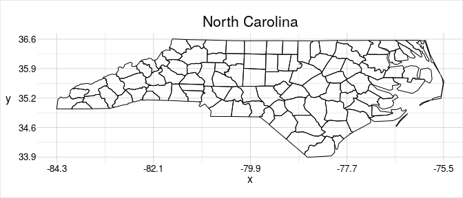
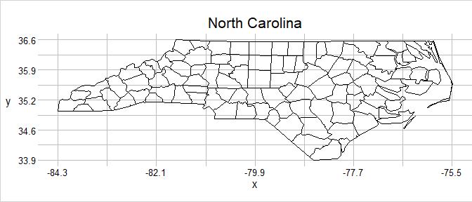
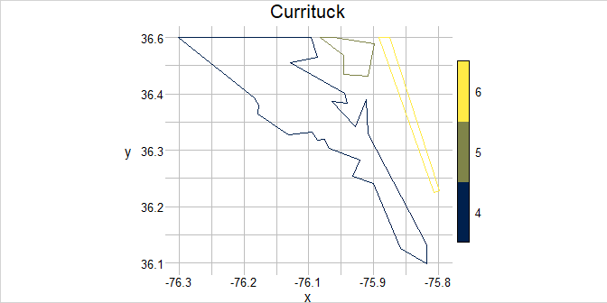

<!-- README.md is generated from README.Rmd. Please edit that file -->

# geometr <a href='https://ehrmanns.github.io/geometr/'></a>

[](https://cran.r-project.org/package=geometr)
[](https://travis-ci.org/EhrmannS/geometr)
[](https://ci.appveyor.com/project/EhrmannS/geometr)
[](https://codecov.io/github/EhrmannS/geometr?branch=master)
[](https://cran.r-project.org/package=geometr)
[](https://www.tidyverse.org/lifecycle/#maturing)

## Overview

The `geometr` package provides tools that generate and process easily
accessible and tidy geometric shapes (of class `geom`). Moreover, it
aims to improve interoperability of spatial and other geometric classes.
Spatial classes are typically a collection of geometric shapes (or their
vertices) that are accompanied by various metadata (such as attributes
and a coordinate reference system). Most spatial classes are thus
conceptually quite similar, yet a common standard lacks for accessing
features, vertices or the metadata. `Geometr` fills this gap by
providing tools that

  - produce an identical output for the same metadata of different
    classes (via so-called getters) and
  - use an identical input to write to various classes that originally
    require different input (via so-called setters).

## Installation

1)  Install the official version from CRAN:

<!-- end list -->

``` r
install.packages("geometr")
```

or the latest development version from github:

``` r
devtools::install_github("EhrmannS/geometr")
```

2)  The
    [vignette](https://ehrmanns.github.io/geometr/articles/geometr.html)
    gives an in depth introduction, explains the take on
    interoperability and discusses the spatial class `geom` that comes
    with `geometr`.

3)  Have fun being a
    [geometer](https://en.wikipedia.org/wiki/List_of_geometers)\!

## Examples

Create a `geom`

``` r
library(geometr)

# ... from other classes
library(sf)
#> Linking to GEOS 3.5.1, GDAL 2.2.2, PROJ 4.9.2
nc_sf <- st_read(system.file("shape/nc.shp", package="sf"), quiet = TRUE)
nc_geom <- gc_geom(input = nc_sf)

# ... or by hand.
library(tibble)
coords <- tibble(x = c(40, 70, 70, 50),
                 y = c(40, 40, 60, 70))
window <- tibble(x = c(0, 80),
                 y = c(0, 80))
aGeom <- gs_polygon(anchor = coords, window = window)

# The "tiny map" shows where the vertices are concentrated.
nc_geom
#> geom        polygon
#>             100 groups | 108 features | 2529 points
#> crs         +proj=longlat +datum=NAD27 +no_defs
#> attributes  (features) AREA, PERIMETER, CNTY_, CNTY_ID, NAME, FIPS, FIPSNO, CRESS_ID, BIR74, ...
#> tiny map           36.59 
#>                    ◌ ○ ◌ ○        
#>                    ○ ○ ○ ○        
#>                    ◌ ◌ ○ ◌        
#>             -84.32 ◌ ◌ ◌ ◌ -75.46 
#>                    33.88
```

Metadata of different classes can be extracted in interoperable quality
(i.e. the same metadata in different objects/classes have the same name
and the same arrangement).

``` r
getFeatures(x = nc_sf)
#> Registered S3 method overwritten by 'cli':
#>   method     from    
#>   print.boxx spatstat
#> # A tibble: 108 x 16
#>      fid   gid  AREA PERIMETER CNTY_ CNTY_ID NAME  FIPS  FIPSNO CRESS_ID BIR74
#>    <int> <int> <dbl>     <dbl> <dbl>   <dbl> <fct> <fct>  <dbl>    <int> <dbl>
#>  1     1     1 0.114      1.44  1825    1825 Ashe  37009  37009        5  1091
#>  2     2     2 0.061      1.23  1827    1827 Alle… 37005  37005        3   487
#>  3     3     3 0.143      1.63  1828    1828 Surry 37171  37171       86  3188
#>  4     4     4 0.07       2.97  1831    1831 Curr… 37053  37053       27   508
#>  5     5     4 0.07       2.97  1831    1831 Curr… 37053  37053       27   508
#>  6     6     4 0.07       2.97  1831    1831 Curr… 37053  37053       27   508
#>  7     7     5 0.153      2.21  1832    1832 Nort… 37131  37131       66  1421
#>  8     8     6 0.097      1.67  1833    1833 Hert… 37091  37091       46  1452
#>  9     9     7 0.062      1.55  1834    1834 Camd… 37029  37029       15   286
#> 10    10     8 0.091      1.28  1835    1835 Gates 37073  37073       37   420
#> # … with 98 more rows, and 5 more variables: SID74 <dbl>, NWBIR74 <dbl>,
#> #   BIR79 <dbl>, SID79 <dbl>, NWBIR79 <dbl>
getFeatures(x = nc_geom)
#> # A tibble: 108 x 16
#>      fid   gid  AREA PERIMETER CNTY_ CNTY_ID NAME  FIPS  FIPSNO CRESS_ID BIR74
#>    <int> <int> <dbl>     <dbl> <dbl>   <dbl> <fct> <fct>  <dbl>    <int> <dbl>
#>  1     1     1 0.114      1.44  1825    1825 Ashe  37009  37009        5  1091
#>  2     2     2 0.061      1.23  1827    1827 Alle… 37005  37005        3   487
#>  3     3     3 0.143      1.63  1828    1828 Surry 37171  37171       86  3188
#>  4     4     4 0.07       2.97  1831    1831 Curr… 37053  37053       27   508
#>  5     5     4 0.07       2.97  1831    1831 Curr… 37053  37053       27   508
#>  6     6     4 0.07       2.97  1831    1831 Curr… 37053  37053       27   508
#>  7     7     5 0.153      2.21  1832    1832 Nort… 37131  37131       66  1421
#>  8     8     6 0.097      1.67  1833    1833 Hert… 37091  37091       46  1452
#>  9     9     7 0.062      1.55  1834    1834 Camd… 37029  37029       15   286
#> 10    10     8 0.091      1.28  1835    1835 Gates 37073  37073       37   420
#> # … with 98 more rows, and 5 more variables: SID74 <dbl>, NWBIR74 <dbl>,
#> #   BIR79 <dbl>, SID79 <dbl>, NWBIR79 <dbl>
```

`geometr` only knows the feature types `point`, `line`, `polygon` and
`grid` (a systematic lattice of points). In contrast to the simple
features standard, there are no *MULTI\** features. The way simple
features have been implemented in R means that the same information can
be stored in several different ways, which are only interoperable after
a range of tests and corrections. For example, a group of polygons can
make up a `MULTIPOLYGON` with attributes that are valid for the overall
group only. Likewise, the polygons could be stored at the level of
individual "closed paths" as `POLYGON`, with specific attributes per
polygon. Both sets of attributes can only exists either as duplicates
for all group specific attributes in a `POLYGON`, or even more
complicated nested attribute tables at the `MULTIPOLYGON` level.

The backbone of a `geom` are three attribute tables, one for points,
features and groups of features, the latter two of which can be provided
with ancillary information. Each feature is stored as a single unit, all
of which are related to other features by a group ID, which relates the
features to attributes for an overall group. Eventually this results in
a tidier data-structure with easier access than `Spatial*` of `sf`
objects and with higher
versatility.

``` r
# when using the group = TRUE argument, the attributes of MULTI*-feature are
# stored in the group attribute table of a geom
nc_geom <- gc_geom(input = nc_sf, group = TRUE)
currituck <- getFeatures(x = nc_geom, gid == 4)

getFeatures(x = currituck)
#> # A tibble: 3 x 2
#>     fid   gid
#>   <int> <int>
#> 1     4     4
#> 2     5     4
#> 3     6     4
getGroups(x = currituck)
#> # A tibble: 1 x 15
#>     gid  AREA PERIMETER CNTY_ CNTY_ID NAME  FIPS  FIPSNO CRESS_ID BIR74 SID74
#>   <int> <dbl>     <dbl> <dbl>   <dbl> <fct> <fct>  <dbl>    <int> <dbl> <dbl>
#> 1     4  0.07      2.97  1831    1831 Curr… 37053  37053       27   508     1
#> # … with 4 more variables: NWBIR74 <dbl>, BIR79 <dbl>, SID79 <dbl>,
#> #   NWBIR79 <dbl>

# and new attributes can be set easily, 
newTable <- data.frame(fid = c(1:108), 
                       attrib = rnorm(108))
(nc_geom <- setFeatures(x = nc_geom, table = newTable))
#> geom        polygon
#>             100 groups | 108 features | 2529 points
#> crs         +proj=longlat +datum=NAD27 +no_defs
#> attributes  (features) attrib
#>            (groups) AREA, PERIMETER, CNTY_, CNTY_ID, NAME, FIPS, FIPSNO, CRESS_ID, BIR74, ...
#> tiny map           36.59 
#>                    ◌ ○ ◌ ○        
#>                    ○ ○ ○ ○        
#>                    ◌ ◌ ○ ◌        
#>             -84.32 ◌ ◌ ◌ ◌ -75.46 
#>                    33.88
```

`geometr` comes with the `visualise` function, which makes nice-looking
diagnostic spatial plots, that show explicit values whenever possible.
For example, it does not create artificial bins for the values scale,
but shows the explicit range of values. Moreover, you can easily set
plot titles without much effort.

``` r
visualise(`North Carolina` = nc_geom)
```



By default, `visualise` uses the feature ID as fillcolour. You can use
quick options to modify which aspect given object should be shown in the
plot, for example to scale the `fillcol`our to the attribute `NWBIR74`.

``` r
myAttr <- "NWBIR74"
visualise(!!paste0("NC - ", myAttr) := nc_geom, fillcol = !!myAttr)
```



Each `geom` has the slot `@window`, which contains a reference window.
This reference window can be used or modified in many functions of
`geometr`

``` r
visualise(`Currituck` = currituck, window = getExtent(currituck))
```


Finally, cast a `geom` to another type simply by providing it in
`anchor` of the respective type

``` r
library(magrittr)
boundPoints <- gs_point(anchor = currituck) %>% 
   setWindow(to = getExtent(.))
visualise(`Currituck - boundary vertices`= boundPoints, linecol = fid)
```


